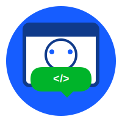

# AI Webot - Python编程+自动化学习实践项目

<div align="center">
  </img>
  
  <h1>AI Webot</h1>
  <p><strong>网页端AI机器人聚合框架</strong></p>
  
  <p>
    
    
    
    
  </p>
  
  <p><em>一个编程学习者的自动化工具实践 · 学中做 · 做中学</em></p>
  
  <p>
    <a href="#项目简介">项目简介</a> •
    <a href="#核心特性">核心特性</a> •
    <a href="#快速开始">快速开始</a> •
    <a href="#使用方式">使用方式</a> •
    <a href="#学习历程">学习历程</a>
  </p>
  
  <p>
    <a href="https://gitee.com/ai_webot">项目地址</a> •
    <a href="#开发指南">开发指南</a> •
    <a href="#开源协议">开源协议</a> •
    <a href="#联系方式">联系交流</a>
  </p>
</div>

## 项目简介

> **项目驱动 · 开源实践 · 实战学习 · 自造工具**

本项目以 **「为自己造工具」** 为精神内核，驱动学习者通过亲手构建「AI机器人聚合」这一真实、完整的项目，贯通从学习、实践到产出个人作品的核心闭环。

### 学习哲学
- **好的学习是创造能用的东西** - 告别玩具代码，从第一行开始就构建真实可用的工具
- **真实的反馈来自自己每天使用** - 你将是自己产品的第一个也是最重要的用户
- **有效的成长来自解决自己的痛点** - 我的真实需求 = 最好的产品经理
- **纯粹的动力就是"我需要这个功能"** - 为用而学，学以致用

### 「学做练用」深度循环
| 阶段 | 核心行动 | 具体实践 |
|------|----------|----------|
| **学于需** | 为解决项目中的具体障碍而学习 | 遇到技术难题 → 针对性学习 |
| **做于即** | 立即编写代码，验证理解 | 学完马上编码实现功能 |
| **练于精** | 通过调试、测试、优化内化知识 | 重构代码、写单元测试、性能优化 |
| **用于己** | 产出为自己服务的工具，持续迭代 | 每天使用自己的工具并改进 |

### 项目核心优势

| 优势 | 说明 | 收获 |
|------|------|------|
| **真实驱动** | 构建**可部署、可访问、具备真实功能**的产品，体验完整开发心流 | 从想法到产品的全流程经验 |
| **技能完整** | 覆盖前端交互、后端逻辑、API集成、部署运维的现代软件开发全栈技能链 | 架构完整、技术闭环的可用应用 |
| **标准规范** | 遵循PEP 8代码规范，实践版本控制、单元测试、模块化设计等标准工程实践 | 写出**清晰、可维护、符合工业标准**的代码 |
| **成果赋能** | 收获一个**亲手打造、可写进简历、能持续迭代**的智能工具 | 能力的延伸和下一次创造的起点 |

## 核心特性

### 多平台AI支持
| 平台 | 状态 | 登录方式 | 文件上传 | 核心特点 |
|------|------|----------|----------|----------|
| **DeepSeek** | 完成 | 手动登录 | 支持 | 历史对话、Markdown复制、按目录上传 |
| **豆包** | 完成 | 游客/手动 | 支持 | 游客模式可用、对话、 按目录上传|
| **通义千问** | 完成| 游客/手动 | 支持 | 对话、双通道上传、多格式支持 |

### 核心功能
- **多AI聚合** - 一站式管理多个AI对话，无需频繁切换网站
- **文件处理** - 支持单文件/多文件上传，自动处理目录结构
- **实时交互** - 仿聊天界面，多轮对话
- **便捷集成** - 剪贴板一键复制，Markdown格式保存

## 项目架构

### 整体架构
```
ai-webot/
├── ai_webot/
│   ├── drivers/          # 学习浏览器自动化
│   │   └── browser.py    # Playwright封装实践
│   ├── services/         # 学习服务层设计
│   │   ├── config_service.py  # 配置管理学习
│   │   └── file_exceptions.py # 异常处理学习
│   ├── webot/            # 学习抽象和继承
│   │   ├── base/         # 抽象基类实践
│   │   ├── deepseek/     # 具体实现学习
│   │   ├── doubao/       # 平台适配练习
│   │   └── qianwen/      # 多平台对比学习
│   ├── api.py            # 学习设计模式
│   └── cli.py            # 学习命令行开发
├── configs/              # 配置文件学习
└── output/               # 输出管理练习
```

### 技术演进路线
```
第1阶段：纯CLI工具 (已完成)
├── 核心: Playwright + asyncio + Python
└── 成果: 命令行自动化工具

第2阶段：增加GUI界面 (进行中)
├── 核心: PySide6 + 异步适配
└── 目标: 可视化操作，降低使用门槛

```

## 快速开始

### 系统要求
- **Python**: 3.8 或更高版本（Python 3.13.0 实测）
- **浏览器**: Chromium (自动安装)
- **操作系统**: Windows 10+/macOS 10.15+/Linux

### 安装指南

#### 最小安装（仅CLI）
```bash
# 1. 克隆项目
git clone https://gitee.com/ai_webot.git
cd ai-webot

# 2. 安装依赖（推荐使用Poetry）
poetry install

# 3. 安装Playwright浏览器
poetry run playwright install chromium

# 4. 生成配置文件
poetry run python scripts/generate_configs.py
```

### 配置文件设置
每个AI平台需要单独的配置文件：

```bash
# 生成所有配置模板
poetry run python scripts/generate_configs.py

# 编辑具体配置（以DeepSeek为例）
# 文件位置: configs/deepseek.yaml
# 需要设置: cookies、登录状态等
```

## 使用方式

### 命令行界面（CLI）
```bash
# 查看帮助
poetry run ai-webot --help

# 列出可用机器人
poetry run ai-webot list

# 单次提问
poetry run ai-webot ask deepseek "Python异步编程的最佳实践？"

# 进入对话模式
poetry run ai-webot chat deepseek

# 上传文件分析
poetry run ai-webot ask deepseek "优化这段代码" file:./example.py

# 分析整个目录
poetry run ai-webot ask deepseek "分析项目结构" dir:./src
```


## 学习历程

### 技术学习路线
| 阶段 | 核心技术 | 实践产出 | 学习重点 |
|------|----------|----------|----------|
| **基础** | Python异步编程 | 异步消息处理核心 | asyncio、异步上下文管理 |
| **进阶** | Playwright深度使用 | 多平台机器人适配 | 页面自动化、选择器策略 |
| **架构** | 设计模式应用 | 工厂模式+抽象基类 | 可扩展架构设计 |
| **工程** | 项目架构设计 | 分层模块化架构 | 高内聚低耦合 |
| **扩展** | GUI开发(PySide6) | 现代化图形界面 | 信号槽机制、MVVM模式 |
| **工具** | Poetry，pytest、mypy | 项目构建、单元测试 | 项目管理、单元测试 |


## 开发指南

### 项目结构详解
```
ai-webot/
├── ai_webot/
│   ├── drivers/          # 学习浏览器自动化
│   │   └── browser.py    # Playwright封装实践
│   ├── services/         # 学习服务层设计
│   │   ├── config_service.py  # 配置管理学习
│   │   └── file_exceptions.py # 异常处理学习
│   ├── webot/            # 学习抽象和继承
│   │   ├── base/         # 抽象基类实践
│   │   ├── deepseek/     # 具体实现学习
│   │   ├── doubao/       # 平台适配练习
│   │   └── qianwen/      # 多平台对比学习
│   ├── api.py            # 学习设计模式
│   └── cli.py            # 学习命令行开发
├── configs/              # 配置文件学习
└── output/               # 输出管理练习
```

### 扩展新AI平台（学习案例）
1. **分析目标网站**
   - 登录方式（账号/游客/cookie）
   - 消息发送与接收机制
   - 页面DOM结构特点

2. **实现机器人基类**
```python
from ai_webot.webot.base.web_bot import WebBot

class NewPlatformBot(WebBot):
    def requires_login(self) -> bool:
        """是否需要登录（学习接口设计）"""
        return True
    
    async def login(self) -> bool:
        """登录实现（学习异步操作）"""
        # 具体登录逻辑
        await self.page.click("#login-btn")
        await self.page.fill("#username", self.config.username)
        # ...
        
    async def send_message(self, message: str) -> str:
        """发送消息并获取回复（学习核心业务）"""
        await self.page.fill(".input-box", message)
        await self.page.click(".send-btn")
        return await self._wait_for_response()
```

3. **创建配置文件**
```yaml
# configs/new_platform.yaml
name: "新平台"
description: "平台功能描述"
plugin:
  module: "ai_webot.webot.new_platform.bot"
  class: "NewPlatformBot"
config:
  login_type: "manual"  # 或 cookie/auto
  # 其他平台特有配置
```


## 项目状态与路线图

### 当前版本 (v0.1.0) 
- [x] **核心CLI框架** - 稳定可用的命令行工具
- [x] **多平台支持** - DeepSeek、豆包、通义千问
- [x] **文件处理** - 单文件、多文件、目录上传

### 短期目标 (2026年)
- [ ] **GUI基础** - PySide6界面框架搭建
- [ ] **GUI功能完善** - 完整的聊天界面和设置面板
- [ ] **主题系统** - 深色/浅色主题切换
- [ ] **配置管理** - 可视化配置编辑
- [ ] **测试覆盖** - 核心功能单元测试

### 中期规划 (XXXX年)
- [ ] **插件系统** - 可扩展的机器人插件机制
- [ ] **高级功能** - 批量处理、工作流自动化
- [ ] **性能优化** - 响应速度提升，资源占用优化
- [ ] **完整文档** - 开发指南、API文档、视频教程

### 长期愿景
- 成为Python全栈开发的优秀学习案例
- 展示从CLI工具到GUI应用的完整演进过程
- 提供可复用的项目架构和设计模式实践
- 积累从零到一的完整项目开发经验

## 开源协议

### 许可证说明
本项目采用 **MIT License with Educational Use Restrictions**。

#### 核心许可结构
```
AI Webot 项目
├── 核心代码: MIT许可证（带教育用途限制）
├── Playwright: Apache 2.0许可证
└── 其他依赖: 各自的开源许可证
```

### 重要使用限制
1. **仅限教育学习用途** - 禁止用于生产环境或商业用途
2. **遵守第三方条款** - 必须遵守目标AI平台的服务条款
3. **责任自负原则** - 使用者需自行承担所有风险和责任
4. **许可证保持** - 任何衍生作品必须保留相同的许可证声明

### 第三方组件许可
- **Playwright** - [Apache License 2.0](https://github.com/microsoft/playwright-python/blob/main/LICENSE)
- **其他Python依赖** - 均为MIT/BSD类开源许可证

## ⚠️ 免责声明

**重要提示：这是一个纯粹的教育学习项目**

### 使用前必须同意
1. **合法合规使用** - 确保你的使用方式符合所有相关法律法规
2. **尊重平台规则** - 严格遵守各AI平台的服务条款和使用政策
3. **合理使用原则** - 不对目标网站造成过大负担或干扰
4. **风险自担声明** - 作者不对任何使用后果承担责任

### 明确禁止行为
- ❌ 任何商业应用或生产环境部署
- ❌ 违反服务条款的自动化操作
- ❌ 未经授权的大规模数据采集
- ❌ 任何违法或侵权用途
- ❌ 高频请求或对服务造成压力的行为

### 项目教育目的
本项目的主要目标是：
- **技术学习** - Python异步编程、浏览器自动化、GUI开发
- **工程实践** - 项目架构设计、代码规范、测试驱动
- **问题解决** - 通过构建真实工具培养解决实际问题的能力
- **经验积累** - 记录完整的项目开发和学习历程

**这不是一个生产就绪的工具**，而是学习过程中的实践产物和成长记录。


## 贡献与交流

### 欢迎的贡献类型
- **文档改进** - 纠正错别字，优化表述，补充示例
- **问题反馈** - 报告Bug，提出改进建议
- **技术讨论** - 分享学习心得，讨论实现方案
- **代码优化** - 性能改进，代码重构建议

### 项目定位说明
这是一个**个人学习导向**的项目，重点在于：
1. **学习过程记录** - 每个commit都是成长的见证
2. **技术实践探索** - 尝试新技术，实践新架构
3. **真实需求驱动** - 解决自己遇到的实际问题
4. **经验分享交流** - 将学习心得转化为可复用的知识

### 交流渠道
- **问题讨论**：[GitHub Issues](https://gitee.com/ai_webot/issues)
- **技术交流**：项目讨论区
- **学习分享**：欢迎提交学习笔记和实践心得
- **建议反馈**：任何有助于学习的建议都欢迎

## 学习资源推荐

### 核心技术栈
- **[Playwright Python](https://playwright.dev/python/)** - 浏览器自动化权威指南
- **[Python异步编程](https://docs.python.org/zh-cn/3/library/asyncio.html)** - 官方异步编程文档

### 推荐学习路径
1. **基础阶段**
   - Python异步编程基础
   - Playwright核心API掌握
   - 简单页面自动化实践

2. **进阶阶段**
   - 设计模式在实际项目中的应用
   - 项目架构设计与模块划分
   - 错误处理与日志系统

3. **拓展阶段**
   - PySide6 GUI开发入门
   - 信号槽机制与自定义组件
   - 测试驱动开发实践

### 参考项目
- [playwright-python-examples](https://github.com/microsoft/playwright-python/tree/main/examples) - 官方示例库
- [awesome-python-applications](https://github.com/mahmoud/awesome-python-applications) - Python应用灵感

## 联系与支持

- **项目仓库**: [https://gitee.com/icodewr/ai_webot](https://gitee.com/icodewr/ai_webot)
- **学习交流**: 欢迎在Issues中讨论技术问题
- **问题反馈**: Bug报告和功能建议
- **技术讨论**: 架构设计、实现方案交流

**重要提示**: 
这是一个**个人学习项目**，主要时间用于编码和学习，因此：
- 回复可能不够及时，但所有有价值的问题都会认真对待
- 更欢迎技术实现方案的讨论，而非单纯的使用问题
- 鼓励学习者自己探索和解决问题，这也是学习的一部分

---

<div align="center">

## 项目宗旨回顾

**这不是一个产品，而是一个学习过程**

每一个功能都是因为“我需要”，每一行代码都是因为“我想学”，每一次提交都是成长的印记。

---

### 学习理念
> **代码不止，学习不息**
> 
> 最好的教程是亲手创造一个有用的工具
> 最深的记忆是解决一个真实遇到的问题
> 最强的动力是“我需要这个功能”

---

**重要提醒**：使用前请务必阅读完整的[免责声明](#免责声明)和[开源协议](#开源协议)部分。

---

<strong>码上工坊 © 2026</strong><br>
<em>让代码为你工作，在创造中学习成长 🚀</em>

</div>
<div align="center">
  </img>
</div>

---

*最后更新: 2026年2月4日 | 版本: v0.1.0 | 学习永无止境*